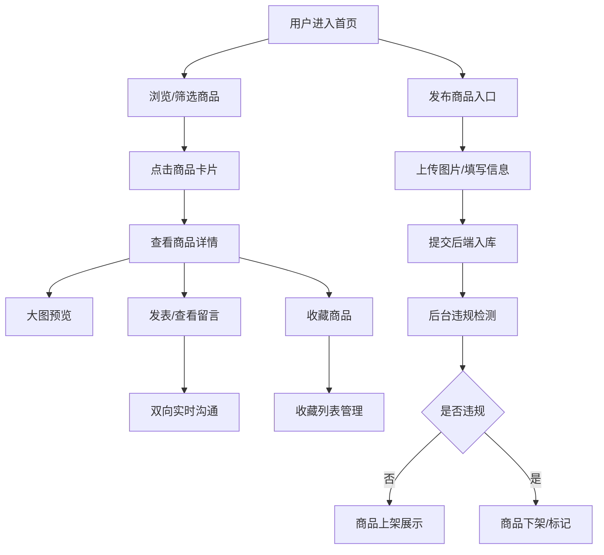

# 二手交易应用产品需求文档 (PRD)

## 1. 产品概述
二手交易应用是一款面向个人用户的C2C闲置物品交易平台，用户可发布二手商品、浏览筛选、在线沟通并收藏心仪物品。
- 核心目标：提供安全、便捷的二手商品线上交易体验
- 市场价值：解决闲置物品流转问题，降低交易门槛，提升沟通效率

## 2. 核心功能

### 2.1 用户角色
| 角色 | 注册方式 | 核心权限 |
|------|----------|----------|
| 普通用户 | 默认登录 | 发布商品、浏览筛选、留言沟通、收藏管理 |
| 管理员 | 后台入口 | 违规检测、商品下架、分类管理 |

### 2.2 功能模块
1. **首页/商品列表**：商品卡片展示、分类导航、多条件筛选
2. **商品发布页**：图片上传、信息录入、分类选择、表单提交
3. **商品详情页**：大图预览、商品信息、在线留言板块
4. **收藏列表页**：已收藏商品展示、取消收藏、跳转详情
5. **管理后台**：违规检测面板、商品上下架、分类增删改

### 2.3 页面详情
| 页面名称 | 模块名称 | 功能描述 |
|----------|----------|----------|
| 首页/商品列表 | 顶部导航 | Logo、发布入口、收藏入口、分类导航 |
| 首页/商品列表 | 筛选区 | 价格区间、发布时间、品类多条件筛选 |
| 首页/商品列表 | 商品卡片 | 缩略图、标题、价格、品类、发布时间、收藏按钮 |
| 商品发布页 | 图片上传 | 多图上传、预览、删除、拖拽排序 |
| 商品发布页 | 信息录入 | 标题、描述、价格、联系方式、分类选择 |
| 商品详情页 | 大图预览 | 轮播切换、点击放大、缩略图导航 |
| 商品详情页 | 留言板块 | 双向留言、实时刷新、时间戳显示 |
| 收藏列表页 | 收藏管理 | 收藏商品网格、批量取消、详情跳转 |
| 管理后台 | 违规检测 | 关键词扫描、违规标记、一键下架 |
| 管理后台 | 分类管理 | 分类增删改、层级管理 |

## 3. 核心流程
用户打开应用 → 浏览商品列表 → 通过筛选条件定位目标商品 → 进入详情页查看大图与信息 → 发表留言与卖家沟通 → 收藏心仪商品 → 发布自有商品 → 后台审核处理

## 4. 用户界面设计

### 4.1 设计风格
- 主色调：暖橙色 #FF7A45（活力/交易），辅助色：深青蓝 #1A535C（稳重/信任）
- 按钮风格：圆润大按钮（圆角12px），悬停微上浮阴影
- 字体：标题用"思源黑体 Bold"，正文用"PingFang SC Regular"
- 布局风格：卡片式栅格布局，顶部导航 + 左侧筛选 + 主内容区
- 图标风格：线性简约图标（lucide-react），统一描边宽度

### 4.2 页面设计概述
| 页面名称 | 模块名称 | UI元素 |
|----------|----------|--------|
| 商品列表 | 商品卡片 | 图片占位+渐变遮罩、角标品类标签、价格高亮、收藏心形图标 |
| 商品发布 | 表单区域 | 拖拽上传区（虚线边框+hover高亮）、输入框聚焦描边、下拉联动选择 |
| 商品详情 | 大图预览 | 主图+左右箭头+底部缩略图条、点击弹窗放大模式 |
| 商品详情 | 留言板块 | 气泡式消息（左收右发）、输入框固定底部、自动滚动到底部 |
| 管理后台 | 数据面板 | 表格+状态标签（绿上架/红下架/黄违规）、操作按钮组 |

### 4.3 响应式
- Desktop优先（1280px基准栅格12列）
- 平板端（768px）：筛选区折叠为抽屉，商品卡片改为2列
- 移动端（375px）：单列瀑布流，底部Tab导航，触摸优化

### 4.4 动效细节
- 页面加载：导航渐入 + 卡片错落浮现（staggered 60ms）
- 卡片悬停：translateY(-4px) + box-shadow 加深
- 收藏按钮：点击心形填充 + 小弹跳动画（scale 1.2 → 1.0）
- 留言发送：消息气泡从右滑入 + 渐显
