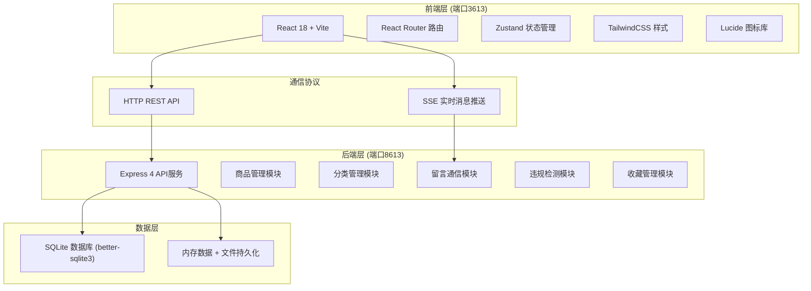
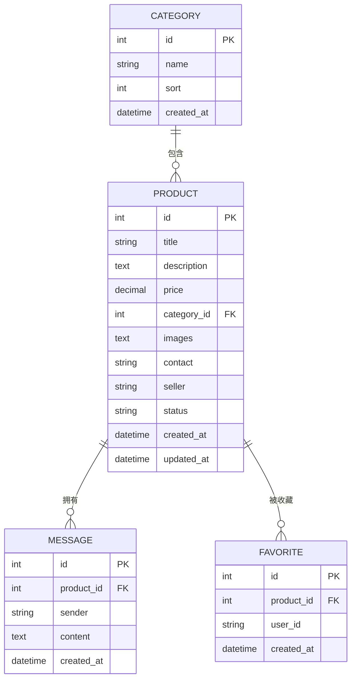

# 二手交易应用技术架构文档

## 1. 架构设计


## 2. 技术描述
- **前端**：React@18 + TypeScript + Vite + React Router DOM + TailwindCSS@3 + Zustand + Lucide React
- **初始化工具**：vite-init 模板 react-express-ts
- **后端**：Express@4 + TypeScript + better-sqlite3 + multer (文件上传) + SSE (Server-Sent Events)
- **数据库**：SQLite 本地文件数据库，无需外部服务
- **文件存储**：本地文件系统 `api/uploads/` 目录存储上传图片
- **前端端口**：3613
- **后端端口**：8613

## 3. 路由定义
| 路由 | 页面 | 用途 |
|------|------|------|
| / | 首页/商品列表 | 展示所有上架商品，支持多条件筛选 |
| /publish | 商品发布页 | 图片上传、信息录入、分类选择 |
| /product/:id | 商品详情页 | 大图预览、商品信息、在线留言 |
| /favorites | 收藏列表页 | 展示已收藏商品，支持管理 |
| /admin | 管理后台 | 违规检测、商品上下架、分类管理 |

## 4. API 定义

### 4.1 商品相关
```typescript
// GET /api/products - 获取商品列表（支持筛选）
interface ProductListQuery {
  categoryId?: number;
  minPrice?: number;
  maxPrice?: number;
  startDate?: string;
  endDate?: string;
  keyword?: string;
  status?: 'on' | 'off';
}

interface Product {
  id: number;
  title: string;
  description: string;
  price: number;
  categoryId: number;
  categoryName: string;
  images: string[];
  contact: string;
  seller: string;
  status: 'on' | 'off' | 'violation';
  createdAt: string;
  updatedAt: string;
}

// POST /api/products - 发布商品
interface PublishProductRequest {
  title: string;
  description: string;
  price: number;
  categoryId: number;
  images: string[];
  contact: string;
  seller: string;
}

// GET /api/products/:id - 获取商品详情
// PUT /api/products/:id/status - 更新商品状态（上下架/违规）
interface UpdateStatusRequest { status: 'on' | 'off' | 'violation'; }
```

### 4.2 分类相关
```typescript
interface Category {
  id: number;
  name: string;
  icon?: string;
  sort: number;
  createdAt: string;
}
// GET /api/categories - 获取所有分类
// POST /api/categories - 新增分类
// PUT /api/categories/:id - 修改分类
// DELETE /api/categories/:id - 删除分类
```

### 4.3 收藏相关
```typescript
// POST /api/favorites/:productId - 收藏/取消收藏
// GET /api/favorites - 获取收藏列表
// DELETE /api/favorites/:productId - 取消收藏
```

### 4.4 留言相关
```typescript
interface Message {
  id: number;
  productId: number;
  sender: string;
  content: string;
  createdAt: string;
  isMine: boolean;
}
// GET /api/messages/:productId - 获取商品留言列表
// POST /api/messages - 发送留言
// GET /api/messages/stream/:productId - SSE 实时订阅留言
```

### 4.5 文件上传
```typescript
// POST /api/upload - 上传图片（multipart/form-data）
// 返回 { url: string; filename: string }
```

### 4.6 违规检测
```typescript
// POST /api/moderation/check - 检测文本违规
interface ModerationCheckRequest { text: string; }
interface ModerationCheckResponse {
  isViolation: boolean;
  matchedKeywords: string[];
  suggestion: string;
}
```

## 5. 服务端架构


- **Routes**：定义API端点与HTTP方法映射
- **Middleware**：CORS跨域、JSON解析、multer文件上传、错误处理
- **Controllers**：参数校验、响应格式化、调用Service
- **Services**：业务逻辑（违规检测算法、状态流转判断）
- **Repositories**：SQL执行、数据CURD封装

## 6. 数据模型

### 6.1 ER图


### 6.2 DDL
```sql
CREATE TABLE IF NOT EXISTS categories (
  id INTEGER PRIMARY KEY AUTOINCREMENT,
  name VARCHAR(50) NOT NULL,
  icon VARCHAR(50),
  sort INTEGER DEFAULT 0,
  created_at DATETIME DEFAULT CURRENT_TIMESTAMP
);

CREATE TABLE IF NOT EXISTS products (
  id INTEGER PRIMARY KEY AUTOINCREMENT,
  title VARCHAR(200) NOT NULL,
  description TEXT,
  price DECIMAL(10,2) NOT NULL DEFAULT 0,
  category_id INTEGER,
  images TEXT,
  contact VARCHAR(100),
  seller VARCHAR(50) DEFAULT '匿名卖家',
  status VARCHAR(20) DEFAULT 'on',
  created_at DATETIME DEFAULT CURRENT_TIMESTAMP,
  updated_at DATETIME DEFAULT CURRENT_TIMESTAMP,
  FOREIGN KEY (category_id) REFERENCES categories(id)
);

CREATE TABLE IF NOT EXISTS messages (
  id INTEGER PRIMARY KEY AUTOINCREMENT,
  product_id INTEGER NOT NULL,
  sender VARCHAR(50) NOT NULL,
  content TEXT NOT NULL,
  created_at DATETIME DEFAULT CURRENT_TIMESTAMP,
  FOREIGN KEY (product_id) REFERENCES products(id)
);

CREATE TABLE IF NOT EXISTS favorites (
  id INTEGER PRIMARY KEY AUTOINCREMENT,
  product_id INTEGER NOT NULL,
  user_id VARCHAR(50) NOT NULL DEFAULT 'guest',
  created_at DATETIME DEFAULT CURRENT_TIMESTAMP,
  FOREIGN KEY (product_id) REFERENCES products(id),
  UNIQUE(product_id, user_id)
);

CREATE INDEX idx_products_category ON products(category_id);
CREATE INDEX idx_products_status ON products(status);
CREATE INDEX idx_products_price ON products(price);
CREATE INDEX idx_messages_product ON messages(product_id);
CREATE INDEX idx_favorites_user ON favorites(user_id);

-- 初始化分类数据
INSERT INTO categories (name, icon, sort) VALUES
  ('数码电子', 'Smartphone', 1),
  ('服饰鞋包', 'Shirt', 2),
  ('家居生活', 'Home', 3),
  ('图书音像', 'BookOpen', 4),
  ('运动户外', 'Dumbbell', 5),
  ('母婴玩具', 'Baby', 6),
  ('美妆个护', 'Sparkles', 7),
  ('汽车用品', 'Car', 8);

-- 初始化示例商品
INSERT INTO products (title, description, price, category_id, images, contact, seller, status) VALUES
  ('iPhone 13 Pro 256G 远峰蓝', '自用9成新，电池健康92%，无磕碰划痕，原装配件齐全，带官方AC+到2025年。', 5200.00, 1, '["https://images.unsplash.com/photo-1632633173522-47456de71b76?w=600"]', '138****8888', '数码达人', 'on'),
  ('MacBook Air M2 午夜色', '2022款，8G+256G，外观完美，循环次数86次，带原装充电器和盒子。', 6800.00, 1, '["https://images.unsplash.com/photo-1517336714731-489689fd1ca8?w=600"]', 'wang@email.com', '小王同学', 'on'),
  ('全新未拆 AirPods Pro 2', '公司年会奖品，未拆封未激活，官网验证，支持验货。', 1399.00, 1, '["https://images.unsplash.com/photo-1600294037681-c80b4cb5b434?w=600"]', '微信airpods2', '幸运锦鲤', 'on'),
  ('优衣库羽绒服 男款L码', '穿了一次就闲置了，保暖性很好，灰色百搭，原价599。', 200.00, 2, '["https://images.unsplash.com/photo-1539533018447-63fcce2678e3?w=600"]', '135****6666', '闲置买家', 'on'),
  ('IKEA宜家马尔姆双人床架', '搬家急出，1.8x2米，9成新，需要自提，送床笠一套。', 500.00, 3, '["https://images.unsplash.com/photo-1505693416388-ac5ce068fe85?w=600"]', '同城自提', '搬家小哥', 'on'),
  ('戴森V10吸尘器 九成新', '购于京东自营，配件齐全，吸力强劲，送全新过滤芯2个。', 1999.00, 3, '["https://images.unsplash.com/photo-1558317374-067fb5f30001?w=600"]', 'dyson_user', '品质生活家', 'on');
```
